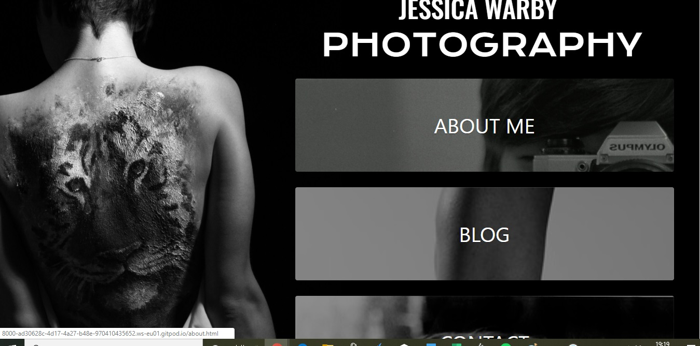
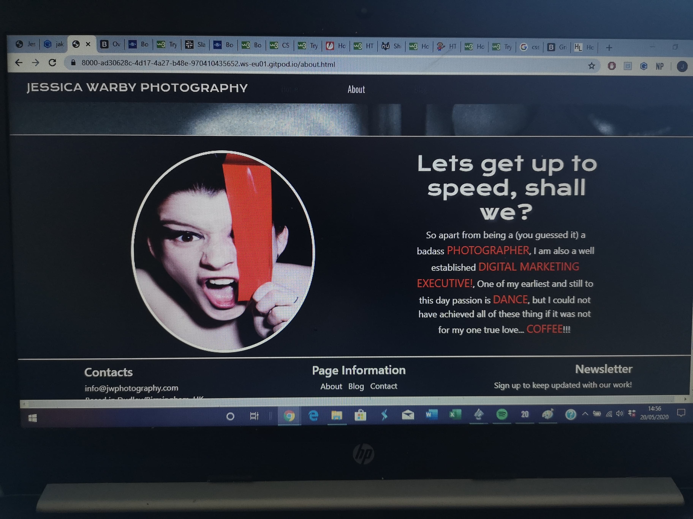

# **JESSICA WARBY PHOTOGRAPHY**

I pitched the idea to my friend Jessica Warby about creating her a new blog-based photography website after I
stumbled on to her old [wix website](https://jesswarby.wixsite.com/jessicawarby), and felt that she needed an update to 
make a more professional looking site. This way it could attract more business on her end, as well as giving me valuable
experience and help create a good account of myself for my course and career prospects.

I created this site as part of my milestone one User-Centric Frontend Development Project with [Code Institute](https://codeinstitute.net/),
Using knowledge of my HTML, CSS and Bootstrap. My intent with this project is to show my capabilities to potential future employers/recruiters who will be able to assess
my skills, qualities and qualifications easily and efficiently.

**You can find a link to the live website** [Here](https://jakefernihough.github.io/jessica-warby-photography/)

# UX

## Website Goals
   * The purpose of creating this site was to help my friend Jessica Warby with her photography business and to create her a new
   updated website, presenting information about her and showcasing her work to potential collaborators.

   * To reach out to other artists/photographers/dancers/talented individuals about collaborating together.

   * To give an indepth look at Jessica's work and personality so potential collaborators can analyse her work.

   * To give a quick and easy way of contacting Jessica to work with projects.

## User Stories
   * I want to go onto a page, with minimal loading time.
   * I want to go onto a page and understand what sort of content is available from the first view.
   * I want an easy and accessable navigation menu to every page.
   * I want the advantage of knowing more about the artist before I commit to working with them.
   * I want to see if we have similar interests that could spur new and consistant projects.
   * I want to know more about what the artist has been doing recently and what product they have produced.
   * I want to make sure their product is of quality content and show they have skill in this field.
   * I want to feel confident that I can come back for new content.
   * I want an easy and accessable way to get in contact with the artist.
   * I want the footer to give me other useful information including social media links about the artist.

## Wireframes
   I first went into this project blind and without direction. So I had a few variations of my index.html page, before
   finally landing on the money. After speaking to my mentor, I started using [Balsamiq](https://balsamiq.com/wireframes/desktop/#)
   to give myself a goal to achieve. I ended up creating 22 wireframes (8 desktop, 7 mobile and 7 ipad). 

* These were some earlier incarnations of the website.
    
    
    
    

*