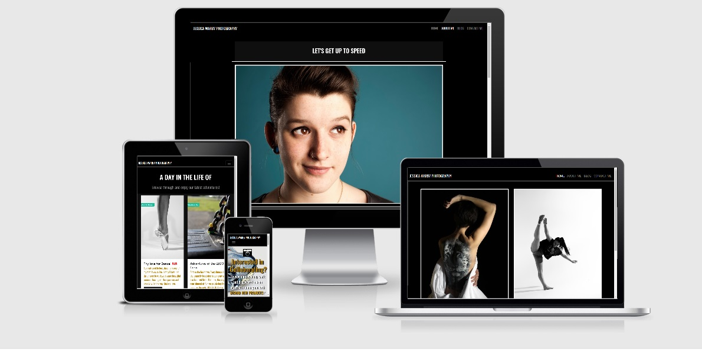
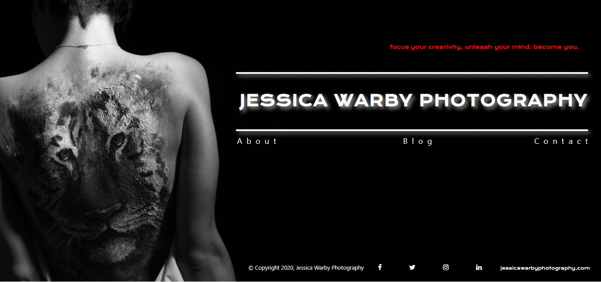
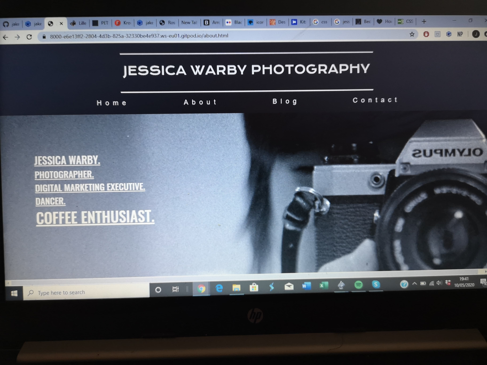

# **JESSICA WARBY PHOTOGRAPHY**

I pitched the idea to my friend Jessica Warby about creating her a new blog-based photography website after I
stumbled on to her old [wix website](https://jesswarby.wixsite.com/jessicawarby), and felt that she needed an update to 
make a more professional looking site. This way it could attract more business on her end, as well as giving me valuable
experience and help create a good account of myself for my course and career prospects.

I created this site as part of my milestone one User-Centric Frontend Development Project with [Code Institute](https://codeinstitute.net/),
Using knowledge of my HTML, CSS and Bootstrap. My intent with this project is to show my capabilities to potential future employers/recruiters who will be able to assess
my skills, qualities and qualifications easily and efficiently.

**You can find a link to the live website** [Here](https://jakefernihough.github.io/jessica-warby-photography/)

# UX

## Website Goals
   * The purpose of creating this site was to help my friend Jessica Warby with her photography business and to create her a new
   updated website, presenting information about her and showcasing her work to potential collaborators.

   * To reach out to other artists/photographers/dancers/talented individuals about collaborating together.

   * To give an indepth look at Jessica's work and personality so potential collaborators can analyse her work.

   * To give a quick and easy way of contacting Jessica to work with projects.

## User Stories
   * I want to go onto a page, with minimal loading time.
   * I want to go onto a page and understand what sort of content is available from the first view.
   * I want an easy and accessable navigation menu to every page.
   * I want the advantage of knowing more about the artist before I commit to working with them.
   * I want to see if we have similar interests that could spur new and consistant projects.
   * I want to know more about what the artist has been doing recently and what product they have produced.
   * I want to make sure their product is of quality content and show they have skill in this field.
   * I want to feel confident that I can come back for new content.
   * I want an easy and accessable way to get in contact with the artist.
   * I want the footer to give me other useful information including social media links about the artist.

## Wireframes
   I first went into this project blind and without direction. So I had a few variations of my index.html page, before
   finally landing on the money. After speaking to my mentor, I started using [Balsamiq](https://balsamiq.com/wireframes/desktop/#)
   to give myself a goal to achieve. I ended up creating 22 wireframes (8 desktop, 7 mobile and 7 ipad). 

* These were some earlier incarnations of the website.
    
    
    

* I ended up writing wireframes and then channeled my energy into making the best possible site I could.
    * I chose to just keep the Navbar displaying the title with the menus at the top and have the images tell the story.
    * I originally had a background-image on every .html doc, but felt it took too much away from the actual content on the screen.
    so apart from the contact.html, I decided to go with a black bg.
    * I built the whole blog-page,html on the desktop, but decided against doing the whole of it for mobile and ipad, as all the content,
    is positioned in the same way.

* I have uploaded my Wireframes up into the [**wireframes**](https://github.com/jakefernihough/jessica-warby-photography/tree/master/assets/Wireframes) directory.
  * If you cannot view them, I have a link to my [**PDF version**](https://drive.google.com/drive/u/0/folders/1kpU71wVGZ_WWGuk8VESfc90-MeDMbTpp).
  * I also have a folder with all the respective [**PNG's**](https://drive.google.com/drive/u/0/folders/11kJ43rk2eBgM4sLIL6BT93G1gdk7KbWd) for your benefit.

# Features

## Existing Features

**Navigation Bar** - I decided to keep the website title on the navbar. It's not in the way of anything, but it is easy to read and see.
The menu links are across on the right. Nothing major, not in your face. When operating a smaller screen, the menu transforms into a hamburger menu
for easier and responsive navigation.

**Home Page** - First page that appears on the screen. This page had a lot of changes, but I settled with having two imaages to showcase
what sort of photographer Jessica is and the quality of content you can expect. They say a picture if worth a thousand words. Well, how about two?

**About Me Page** - Big picture of Jessica. A Bio underneath her picture, to explain who she is, what she has done.
Underneath that, I used a couple more of her photo's and explained about her work.

**Blog** - just a quick sneak-peak of what she has been up to. with links to the full blog.

**Blog-Page** - Her latest stories! filled with her favourite photo's she took during that set. She allows the images to tell the story for her.

**Contact Me Page** - A way to contact Jessica, using her intuitive contact form to send an email about potentially collaborating together.

**Newsletter** - Signing up by entering your email into the input and subscribing to emails about the latest projects.

**Footer** - A recap of the menu, Jessica's details, as well as links to her social media accounts.

## Future Features

  * New _**Blog**_ posts, to show Jessica is actively working with new projects and collaborators.
  * Eventually, will be creating a full _**Portfolio**_ page to showcase all of her work on one page. She is slowly building up her content.
  * A more _**Interactive**_ image viewer. Instead of static images, they will be perform animations whilst scrolling.
  * A _**Collaborators**_ page, showcasing her work with other talented individuals and linking their websites. Ability to leave reviews and comments.
  * Jessica Warby Photography will become a _**Professional Business**_ and will be setting up prices for new packages including Weddings!

# Technologies Used

**HTML5 / Hyper Markup Language** was used for the structure of this website. Further Information is needed at https://developer.mozilla.org/en-US/docs/Web/Guide/HTML/HTML5

**CSS3 / Cascading Style Sheets** was used to style the web pages. More information is located here https://www.w3.org/Style/CSS/Overview.en.html

**Bootstrap 4** was used to create the layout structure of the site on all platforms (desktop, mobile, ipad). I also used bootstrap to create the NavBar, Newsletter and Contact Form. https://getbootstrap.com/

**Font Awesome** was used to find the social media Icons, as well as Icons used on the contact page. https://fontawesome.com/6?next=%2F

**Google Font** I mainly used 'Oswald' Font for most of the website. https://fonts.google.com/

**Github** Apart of Microsoft, Github is the hosting software for website development. https://github.com/

**Gitpod** Used to create code and run within a browser. https://gitpod.io/

**Chrome Dev Tools** was used to test out my code and be able to make adjustments. This was a constant use of mine throughout my development. https://developers.google.com/web/tools/chrome-devtools

**Free Formatter** I used this to beautify my code. https://www.freeformatter.com/html-formatter.html

**W3C Validator** was used to validate all my code and outline any errors. https://validator.w3.org/

**Favicon** - Used to create the small square logo next to web-link.

# Testing

1. I tested out my code using [responsivedesign](http://ami.responsivedesign.is/#) and after tinkering many times, due to the fact the blog page and the index
page had the minimalistic problem on mobile, as the whole screen was not responsive and did not all fit into the screen.
Eventually I found the problem, I forgot to make a container for a section, which caused this problem. **Now Fixed**

2. I mainly used **Google Chrome** as my go-to browser, using the **Dev Tools**. I was first able to make this responsive before I used responsive design to fit
the content onto **Mozilla Firefox**. Lastly, I used **Internet Browser** to success.
    
    *i.* The only common problem I have is when I am narrowing down my desktop browser size, the first blog post is not responsive 
    like the rest of the blog post and has a very narrow width. It is the size between a mobile and tablet device. But its only a momentary lapse, before it corrects.

3. I used https://validator.w3.org/ to check my code for any problems. The two occuring problems is the tags with the links for the Navbar is a "Stray Target, however once I remove them,
the hamburger navigation bar is inaccessable.
   
      *i.* The second problem was the navbar aria-conrols input as it did not target the data-target, however I managed to fix it.

## Test Scenarios

1. **Newsletter** - Go onto About/Blog/Blog-Pages/Contact. Just above the footer.
     
     *i* - Try to submit the form without a correct syntax e-mail address and you will get an error message that requests a valid email address.
     
     *ii* - Submitting the form with empty fields will register a message saying "Please fill in this field"

     *iii* - Press the "get connected" button and if successful, it will refresh the page and you will be signed up to the newsletter.

2. **Contact Form** - click onto the Contact Me page on the NavBar or footer menu.

     *i* - Try to submit the form with empty fields and you will get an error message that requests to fill out form, starting with the Name input.

     *ii* - Try to submit the form without a valid syntaxt email will request the user to input a valid email address.

     *iii* - If the user does not fill out the Message input, the form will request to fill it out before submitting request.

     *iv* - When all fields have been filled out, click the "Let's get started" button and if successful, it will open up a new page [respnse.html](response.html),
     with a _**Thank You**_ message.

3. **NavBar** - Hover over the menu titles and it will brighten up.
 
     *i* - Click onto a menu (e.g Contact), when on the page, the Navbar will permanently have *Contact* highlighted whilst on that page.

4. **Footer** - Links to the pages and links to social media.
  
     *i* - When hovering over the menu/ social media Icons, it shall hover red.

     *ii* - click on a specific link and it will open up that page that you requested.

# Deployment

Created a **GitHub** account at [GitHub](https://github.com) locate my page [Here](https://github.com/jakefernihough)

I uploaded all my files to my **GitHub repository** under the name [Jessica-Warby-Photography](https://github.com/jakefernihough/jessica-warby-photography).

To publish the project, Open up the *settings*, scroll down to the section titled *GitHub Pages*. Under the *Source* setting, select **master branch**.

Refresh the page. and a link the **[live](https://jakefernihough.github.io/jessica-warby-photography/)** website can be found and viewed. https://jakefernihough.github.io/jessica-warby-photography/

For more information about deploying, go to **[this page](https://help.github.com/en/github/working-with-github-pages/configuring-a-publishing-source-for-your-github-pages-site)**

  ## How to Run this page Locally

  To clone this project from GitHub:

On GitHub, navigate to the main page of the repository.

On the right-hand side, above the files, press the green button labelled 'Clone or Download'. This button will give you options to  open in desktop or download as a zip file, or clone with HTTPS.

copy the clone URL for the repository.

Open the Terminal.

Change the current working directory to the location where you want the cloned directory to be made.

Type git clone into the terminal and then paste the URL https://github.com/jakefernihough/jessica-warby-photography.git

Press Enter. Your local clone will be created.

More information about git cloning can be found [here](https://help.github.com/en/github/creating-cloning-and-archiving-repositories/cloning-a-repository)

# Your Favicon Package

This package was generated with [RealFaviconGenerator](https://realfavicongenerator.net/) [v0.16](https://realfavicongenerator.net/change_log#v0.16)

## Install instructions

To install this package:

Extract this package in the root of your web site. If your site is <code>http://www.example.com</code>, you should be able to access a file named <code>http://www.example.com/favicon.ico</code>.

Insert the following code in the `head` section of your pages:

    <link rel="apple-touch-icon" sizes="180x180" href="/apple-touch-icon.png">
    <link rel="icon" type="image/png" sizes="32x32" href="/favicon-32x32.png">
    <link rel="icon" type="image/png" sizes="16x16" href="/favicon-16x16.png">
    <link rel="manifest" href="/site.webmanifest">
    <meta name="apple-mobile-web-app-title" content="Jessica Warby Photography">
    <meta name="application-name" content="Jessica Warby Photography">
    <meta name="msapplication-TileColor" content="#b91d47">
    <meta name="theme-color" content="#000000">

*Optional* - Check your favicon with the [favicon checker](https://realfavicongenerator.net/favicon_checker)

# Credits

## Content Used

* **NavBar** was inspired and created by by "Bootstrap 4 navbar example, navigation top menu bootstrap" Bootstrap 4.1.1 Snippet by [vosidiy](https://bootsnipp.com/snippets/nNWr8).
* **Newsletter** was inspired and created by "Bootstrap4 newsletter" Bootstrap 4.1.1 Snippet by [dkstudio](https://bootsnipp.com/snippets/92pvX).
* **Blog Cards** was inspired and created by "bootstrap material style blog cards " Bootstrap 4.1.1 Snippet by [ALIMUL AL RAZY](https://bootsnipp.com/snippets/WaeDX).
* **Contact Form** was inspired and created by "Contact Info" Bootstrap 4.1.1 Snippet by [Nemra1](https://bootsnipp.com/snippets/qrj4g).

### Inspirations 

* I took inspiration from [Peter McKinnon's](https://www.petermckinnon.com/) homepage. especially the black background and white font.
* I got the About Me page and newsletter idea from [Adrieana Blazin Photography](https://blazinphoto.com/), that I incorporated into my work.
* [Liller Photo](http://www.lillerphoto.com/blog) gave me the idea of having a blog-styled page instead of just a gallery page.

## Media 

!! **ALL IMAGES ARE SHOT, EDITED AND OWNED BY JESSICA WARBY OF JESSICA WARBY PHOTOGRAPHY** !!

* All images can be found on Jessica Warby's :- [Wix](https://jesswarby.wixsite.com/jessicawarby), [Flickr](https://www.flickr.com/photos/47256553@N04/?fbclid=IwAR2hoQ0bmxzsWdtyOF7TFMfsRdrL-0_VhhXg3QLteYU9q7Cov96cBDfAIIg),
[Facebook](https://www.facebook.com/Jwarbyphotography) and [Instagram](https://www.instagram.com/naturalflights6/) accounts.

* 'Oswald' font was used throughout the page, thanks to [Google Fonts](https://fonts.google.com/.)
* [Font Awesome](https://fontawesome.com/) was used for the Social Icons found.

## Acknowledgements

* First of all, a big THANK YOU to [CodeInstitute](https://codeinstitute.net/) for teaching me everything I have learnt so far. I have come a long way because of their instructions and guidance.
* A thank you to the [Slack Community](https://app.slack.com/client/T0L30B202/threads), who helped me in my time of needs during this project.
* Shout out to [Lewis Church](https://www.linkedin.com/in/lewis-church-a29b077/), who was the man that got me into starting this course.
* A very big thank you to [Jessica Warby Photography](https://www.facebook.com/Jwarbyphotography) for allowing me to build this website, using all of her content and giving her a brand new Web-Page
that she deserves. As well as being a great friend!

* Lastly, but certainly not least, The person who has guided me through this journey and this creation. Helping me whenever the chance came and being an absolute star mentor, I can not thank [Adegbenga Adeye](https://www.linkedin.com/in/adegbenga-adeye-14003635/)
enough for what he has done to help me.